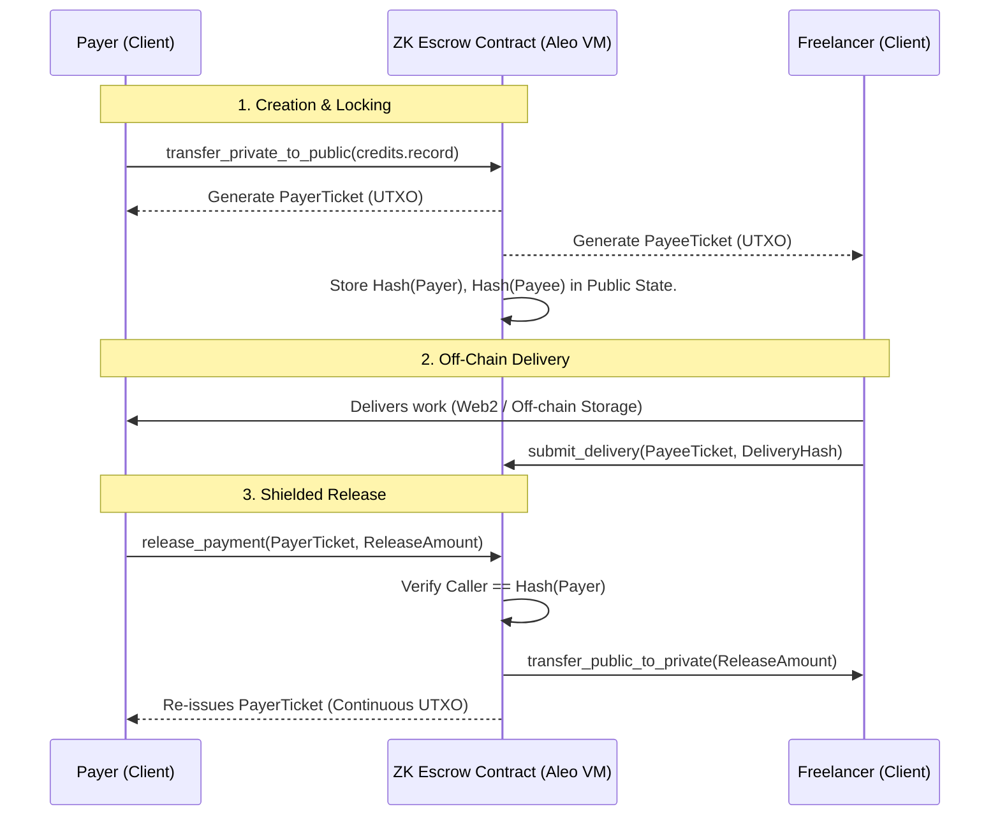

# Technical Architecture: ZK-Escrow Pro V6

The technical architecture of ZK-Escrow Pro is designed with a hybrid state approach that isolates shared constraint logic from privacy-centric identity parameters. This is achieved by intertwining Aleo's public mapping constraints with purely private `record` UTXOs and `BHP256` hash functions.

## 1. State Topology

### The Private Layer (Records)
To achieve zero-knowledge participation, authorization is encapsulated within non-fungible records (Tickets) rather than account balances or flags.
* **`PayerTicket`** and **`PayeeTicket`**: Issued upon contract instantiation. These records reside securely within the user's local Shield Wallet context. They hold specific metadata (`escrow_id`, `amount`) off-chain securely. A user transitions a contract state by proving ownership of a ticket on their local device, generating a SNARK proof that is sent to the network.

### The Public Layer (Mappings)
To prevent double-spending and maintain contract lifecycle bounds, minimal global state is kept mathematically tied to the private layer.
* **`escrows`**: A `field => PublicEscrow` pointer. 
* **`PublicEscrow` Struct**:
  * `amount` and `released_amount`: Keeps a mathematical bounds check for partial payments.
  * `status`: Reentrancy and replay-attack guard (Locked -> Released/Refunded/Disputed).
  * `deadline`: Ensures temporal restrictions on automated triggers.
  * `payer_hash`, `payee_hash`, `mediator_hash`: The core privacy anchor. Identities are stored *exclusively* as `BHP256` fields on the public chain.

## 2. Cryptographic Execution Flow

The contract heavily limits how Aleo credits flow into and out of the system, acting as a shielded vault.

## 3. Threat Model & Mitigations

### 1. Identity Leakage 
**Threat:** The public state of the contract exposes who is performing the contract to blockchain analyzers.
**Mitigation:** `create_escrow` strictly accepts the identity of the payee, runs `BHP256::hash_to_field` locally inside the ZK-circuit, and only publishes the hashed output to the public struct. No address parameters are kept.

### 2. Double Spending & Stale Tickets
**Threat:** Because UTXOs (Tickets) are generated continuously (e.g. performing a partial payment generates a new identical ticket for remaining actions), an older ticket could technically be passed to try and re-trigger an event.
**Mitigation:** The public mapping tightly restricts the `released_amount` and `status` bytes. While a user may have continuous proof they are the Payer, the public mappings block any transition where `released_amount > amount` or `status != 0`.

### 3. Untrusted Mediator
**Threat:** An assigned mediator during a dispute steals the funds by inserting their own address into the winner parameter block.
**Mitigation:** The `resolve_dispute(winner_address, amount)` transition mandates that `winner_hash = BHP256::hash_to_field(winner)`. The finalize block strictly asserts that `winner_hash == data.payer_hash || winner_hash == data.payee_hash`. Since finding a collision for `BHP256` is computationally infeasible, the mediator is mathematically forced to release funds only to the legitimate counter-parties.

## 4. Bounties & Whitelists

An "Open Bounty" works seamlessly within this privacy framework. When an escrow is marked as a bounty:
1. `payee_hash` is initialized pointing to the literal hash of `zero_address`.
2. Any freelancer can invoke `claim_bounty`, executing a local proof consuming the state.
3. The on-chain Finalize block overwrites the default `zero_hash` with the legitimate claimant's hash.
If `is_restricted` is applied, this claim is locked down by comparing the claimant's hash to an expected `whitelist_hash`.
